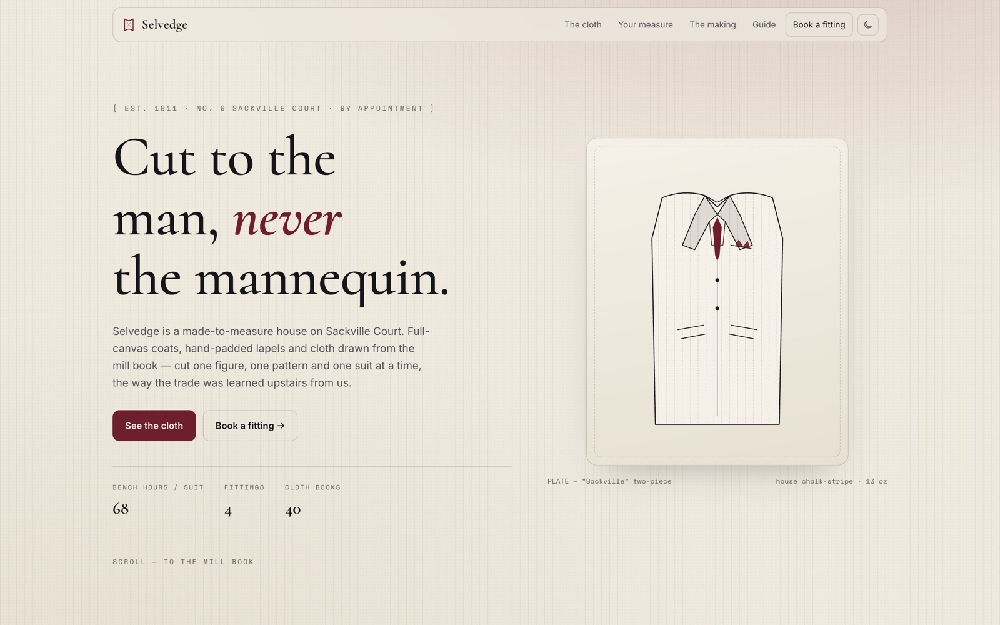

<!-- parable:beautified -->
<div align="center">

<h1>Selvedge</h1>

<p><strong>Bespoke tailoring house — an annotated SVG measurement mannequin and a fabric bolt that unrolls to its weave.</strong></p>

<p>
  <a href="https://bswxyz.github.io/selvedge/"></a>
  
  
  <a href="LICENSE"></a>
</p>

<p>
  <a href="https://bswxyz.github.io/selvedge/"><b>Live demo</b></a>
  &nbsp;·&nbsp;
  <a href="https://bswxyz.github.io/selvedge/guide/">Build notes</a>
  &nbsp;·&nbsp;
  <a href="https://parable-three.vercel.app/templates">More templates</a>
</p>

<a href="https://bswxyz.github.io/selvedge/">
  
</a>

</div>

**Use this template** — copy the source into a new project:

```bash
npx degit bswxyz/selvedge my-app
```


A one-room bespoke tailoring house — an interactive SVG measuring figure draws calipers across a
chalk-lined mannequin as you hover its five measures, and four bolts of illustrated cloth unroll
(clip-path) as they scroll in. Part of the
[Parable design showcase](https://parable-three.vercel.app).

---

## The concept

Selvedge is a fictional made-to-measure house — Est. 1911, No. 9 Sackville Court, by appointment.
The line that carries the site is "Cut to the man, never the mannequin," so the hero shows a coat
as a cutter would draw it: a plate, not a photograph, filled with the house chalk-stripe. Voice is
the trade's own — unhurried, exact, faintly amused: two fingers of ease, a pattern "kept in the
ledger for life," a suit that "can afford to take ten weeks."

## Design system

- **Palette — light is the fitting room, dark is the cutting room after hours.** Tokens flip on
  `:root[data-theme]`: chalk `#efe9de` ↔ charcoal `#16151a`, with one thread of colour — a
  burgundy accent (`#6e1f2e`, lightened to `#c97a86` for text on dark so it clears WCAG AA).
  True fabric colours (`--cloth-*`) are held constant across both themes — cloth doesn't change
  with the light. A faint chalk-stripe sits in a fixed background layer.
- **Type:** `Cormorant` (a fine-nibbed display serif — the ledger hand) · `Inter` (body) ·
  `Space Mono` (measurements, cloth specs, plate captions). One face for the name, one for the
  talk, one for the tape.
- **Signature technique:** an **interactive SVG measuring figure** — five measurement points on a
  line-drawn mannequin; hover or tab one and a caliper draws itself in (`pathLength`/dash-offset)
  while the readout updates — plus **fabric bolts that unroll** via clip-path as they scroll in,
  each filled with a hand-built SVG `<pattern>` weave (chalk-stripe, herringbone, birdseye, glen
  check). Named eases: `cubic-bezier(.16,.84,.24,1)` ("the draw of the needle") and a measured
  in-out for the tapes.
- **Voice:** unhurried, exact, quietly proud. "As much colour as a gentleman needs, and no more."

## Stack

- **Plain HTML / CSS / vanilla JS. No framework, no build step, no bundler** — the weaves are SVG
  patterns and both signatures are CSS-driven, so there is no per-frame loop and no runtime
  dependency. Google Fonts is the page's only external request.
- **Inline SVG** for the jacket plate, the measuring figure, the four weave patterns, the brand
  mark and the theme icons.
- Reveals, animated counters, the caliper draw-ins, the bolt unrolls and the demo form are native
  `IntersectionObserver` + CSS transitions, gated behind an `.js` class so nothing is hidden
  without JavaScript.

## Running it locally

No install — all paths are relative:

```bash
git clone https://github.com/bswxyz/selvedge
cd selvedge
python3 -m http.server 8000      # or: npx serve .
# open http://localhost:8000
```

## Structure

```
index.html          the page (semantic sections; .js gate for progressive enhancement)
styles.css          all styling — design tokens (both themes) live in :root at the top
main.js             theme toggle, reveals, counters, measuring-figure readout, demo form
guide/index.html    the "how it was built" write-up (self-contained, styled to match)
.nojekyll           tells GitHub Pages to serve files as-is
```

## Demo vs. real — what a production version would need

An intentionally-scoped demo. What's **fictional/mocked** today:

- **The house, the cutter and every cloth are fictional.** The mills quoted (Fox Brothers,
  Abraham Moon, Lovat), the prices, the bench hours and the ledger are invented; the weaves are
  illustrative SVG patterns, not photography of real cloth.
- **The fitting form is a demo — it sends nothing.** Submitting validates and confirms in-place
  but stores nothing and emails no one. A real version needs an endpoint (Formspree / a
  serverless function / an email service), spam protection and a bookings calendar.
- **The measurements are illustrative** — a static 40 Regular. A real house takes yours in the
  room.
- **No analytics, no CMS.** Copy and cloths are hand-edited HTML.

What's **real** and reusable as-is: the interactive measuring figure (hover/keyboard, `aria-live`
readout, reduced-motion fallback that draws every caliper), the clip-path bolt-unroll with its
travelling roll-end, the SVG weave patterns, the full light/dark theming, and the whole
responsive / reduced-motion / keyboard layer.

## License

[MIT](LICENSE). Design & build by **Parable**.
